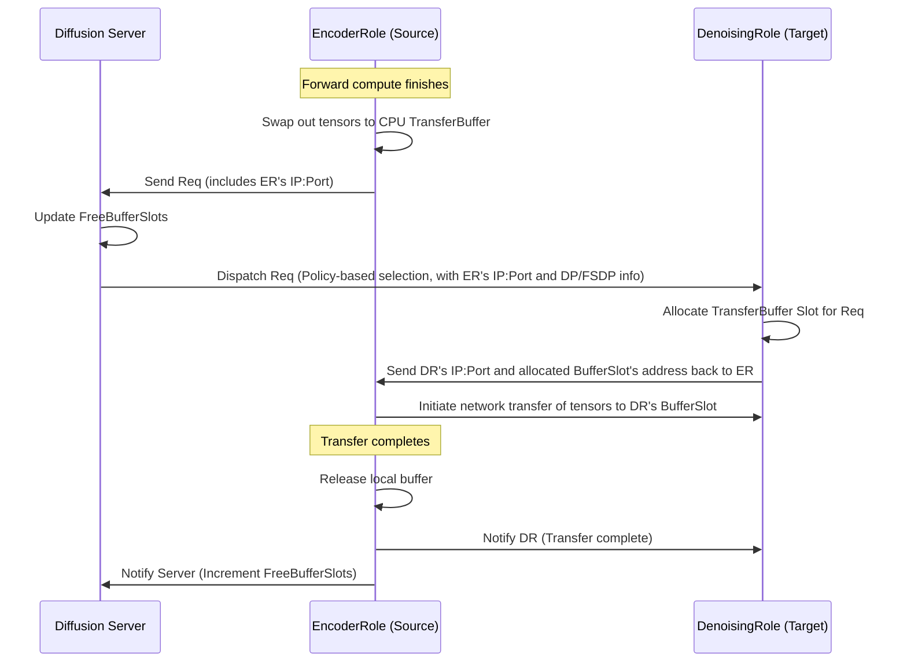

### Checklist

- [x] If this is not a feature request but a general question, please start a discussion at https://github.com/sgl-project/sglang/discussions. Otherwise, it will be closed.
- [x] Please use English. Otherwise, it will be closed.

### Motivation

Prefill-Decode (PD) disaggregation has proven highly effective in optimizing Large Language Models (LLMs). We observe a similar, yet distinct challenge in diffusion models, particularly in Text-to-Video (T2V) generation: massive execution time disparities exist across different pipeline modules (e.g., Text-Encoder, DiT, and VAE). Monolithic deployment forces these heterogeneous stages to share uniform hardware configurations, leading to severe computational bottlenecks. Disaggregation allows us to independently tune the parallelization strategies and GPU allocations for each specific module, thereby maximizing Streaming Multiprocessor (SM) utilization and overall pipeline throughput.

### Related resources

## Background

SGLang has established a mature and highly optimized architecture for LLM PD disaggregation. To extend this capability to vision generation, we propose the **SGLang Diffusion Disaggregation** system. By combining SGLang's robust Mooncake-based data transfer foundation with the unique multi-stage characteristics of diffusion models, this design adapts proven asynchronous routing and memory management techniques to seamlessly handle the heavy, continuous tensor transmission demands of multimodal inference.

## Disaggregated Diffusion Inference: System Design Document

### 1. Role-Based Pipeline Decomposition

The monolithic diffusion pipeline is decoupled into three independent execution roles. The model's `Pipeline` class dynamically alters `_required_config_modules` & `create_pipeline_stages` based on its assigned Role to ensure only necessary weights are loaded into GPU memory.

- **EncoderRole:** Encapsulates `InputValidationStage`, `TextEncodingStage`, `ConditioningStage`, `TimestepPreparationStage`, and `LatentPreparationStage`.
- **DenoisingRole:** Encapsulates `DenoisingStage`.
- **DecoderRole:** Encapsulates `DecodingStage`.

### 2. Core Components per Role

Each Role instance contains the following components to handle asynchronous data transfer and compute execution:

**TransferBuffer (Base Class):** A base class representing the CPU-memory staging area. To optimize both memory management and transmission efficiency, it is decoupled into two specialized subclasses:

- **TransferMetaBuffer:** Stores lightweight, non-tensor metadata within a `Req`. This is conceptually similar to *MetadataBuffers* in PD Disaggregation.
- **TransferTensorBuffer:** A high-performance, pinned-memory pool specifically for heavy tensor payloads (e.g., `latents`). The memory lifecycle here is strictly managed by a dedicated **`TransferTensorBufferAllocator`**, which employs a dynamic, buddy-system-like strategy:
  - **Dynamic Allocation (Split/Aggregate):** The pool is initialized with *`K`* standard-sized slots (based on mainstream resolution/duration configurations). When a tensor arrives, the allocator dynamically splits a slot for smaller requests or aggregates contiguous slots for larger ones, ensuring physical memory contiguity.
  - **Defragmentation (Coalesce):** Upon a tensor's release, the allocator automatically coalesces adjacent free slots. This ongoing defragmentation ensures that large contiguous blocks remain available for subsequent high-resolution requests.
  - **Role-Specific Sizing:** Buffer capacity is highly configurable per Role. For instance, because the `EncoderRole` typically executes much faster than the `DenoisingRole`, using uniform buffer sizes could lead to pipeline stalling or severe backpressure. By independently tuning the buffer sizes, the system can effectively absorb execution speed mismatches and minimize request queuing time.

**TransferringQueue:** Holds requests waiting for incoming network data transfers to complete.

**SwappingQueue:** Holds requests that have received all required data and are ready to be swapped into the GPU (H2D transfer).

**TransferManager:** The execution engine for network communication.

- Maintains the `TransferEngine` and registers `TransferBuffer` memory addresses.
- **`receive_event_loop`:** Listens for incoming target buffer addresses from the next Role, status notifications (success/failure) from the previous Role. It incrementally caches downstream routing (`Instance_ID -> Rank_ID -> IP:Port + TransferBuffer_Address`) and updates request's transmission status accordingly.
- **`send_event_loop`:** Concurrently triggers transfer tasks using a thread pool and task queue. Supports `transfer_slice` to accommodate varying parallelization strategies (e.g., FSDP for EncoderRole & SP for DenoisingRole) across different Roles.

**Request State Tracker (`Transfer.Poll`):** Attached to each request for state synchronization and polling (similar to `KV.Poll`).

### 3. Diffusion Server (Global Dispatcher)

The HTTP server is refactored into a `DiffusionServer`, acting as the global router and load balancer.

- **State Management:** Tracks the complete lifecycle of each request across the cluster using a `FreeBufferSlots` dictionary and a `TryToAdd` (TTA) queue per Role. For example, a request transitions through:
  - **`EncoderRoleWaiting`:** The request enters the `EncoderRole`'s TTA queue.
  - **`EncoderRoleOnGoing`:** Dispatched to an Encoder instance (popped from TTA, slot decremented).
  - **`DenoisingRoleWaiting`:** The Encoder requests a downstream peer. The request joins the `DenoisingRole`'s TTA. Even after the Server allocates a Denoising peer and pops the request from TTA, the state *remains* waiting during network transmission.
  - **`DenoisingRoleOnGoing`:** Triggered only after the upstream Encoder notifies the Server that the data transfer is fully complete. *The server also handles standard terminal state transitions, including `Success`, `Failed`, and `Aborted`.*
- **`dispatch_event_loop`:** Continuously attempts to pop requests from `TryToAdd` queues. It uses a routing policy (e.g., `MaxFreeSlotsFirst`, `RoundRobin`) to select an available Role instance, decrements its `FreeBufferSlots`, and forwards the request.
- **Callback Mechanism:** When a request completes its network transfer on a Role instance, it notifies both the downstream peer and the `DiffusionServer` (to increment the `FreeBufferSlots`).

### 4. End-to-End Workflow & Dataflow

Below is the workflow illustrating the transition from `EncoderRole` to `DenoisingRole`.

**Description:**
1. Once `EncoderRole` finishes its forward pass, it swaps out necessary tensors to the CPU `TransferBuffer` and forwards the request metadata to the `DiffusionServer`.
2. The `DiffusionServer`'s `dispatch_event_loop` selects an optimal `DenoisingRole` instance, forwards the request, and updates slots tracking.
3. Upon receiving the request, `DenoisingRole` allocates a local `TransferBuffer` slot and computes the target `EncoderRole` rank (using its own SP `rank_id` combined with the server-provided `EncoderRole`'s DP/FSDP info). It then sends its `ip:port` and the allocated slot's physical address directly back to this calculated target rank.
4. `EncoderRole` initiates the actual data transmission. Once finished, it releases its local buffer and sends completion notifications to both `DenoisingRole` and `DiffusionServer`.

### 5. CUDA Stream Overlap Scheduling (Pseudocode)

To maximize GPU utilization without introducing CPU blocking or pipeline bubbles, we utilize a 3-stream pipeline approach (Host-to-Device, Compute, Device-to-Host). Crucially, to prevent network starvation, the network transfer trigger is decoupled from rigid batch boundaries and operates at a **request-level granularity**.
The logic is embedded directly into the main scheduling loop. Synchronization (via `torch.cuda.Event`) ensures dependencies are met.
```Python
import torch
from collections import deque
from typing import Optional

class Scheduler:
    @torch.no_grad()
    def event_loop_overlap_disagg_diffusion(self: Scheduler):
        self.result_queue = deque()
        self.last_batch: Optional[Req] = None

        while True:
            # 1. Network & Queue Management
            # Receive incoming requests.
            recv_reqs = self.recv_requests()
            # Allocate local TransferBuffer slots, add to TransferringQueue and notify the previous Role.
            self.process_input_requests(recv_reqs)

            # 2. Swap In (H2D) for FUTURE batch (Batch i+1)
            # Function: process_new_coming_queue
            # Logic: Checks if all required data has arrived over the network.
            # If ready, it pops from TransferringQueue and add to SwappingQueue.
            # Then executes the CPU-to-GPU transfer asynchronously on the dedicated `swap_in_stream`.
            self.process_new_coming_queue()

            # Get the next batch to run (Batch i, which is popped from SwappingQueue).
            # Note: Internally, it must wait for the `swap_in_stream` of Batch i to finish.
            batch = self.get_next_disagg_batch_to_run()
            self.cur_batch = batch

            # 3. Compute for CURRENT batch (Batch i)
            # Function: run_batch
            # Logic: Executes the model forward pass on the `compute_stream`.
            if batch:
                batch_result = self.run_batch(batch)
                self.result_queue.append((batch.copy(), batch_result))
            else:
                batch_result = None

            # 4. Swap Out (D2H) for PAST batch (Batch i-1)
            # Function: process_batch_result
            # Logic: Issues the GPU-to-CPU transfer to the TransferBuffer
            # asynchronously on the `swap_out_stream` and records a CUDA event per request.
            # Note: It does NOT block the CPU to wait for completion here, nor does it
            # trigger network transfer yet, to avoid batch-level pipeline bubbles.
            if self.last_batch:
                tmp_batch, tmp_result = self.result_queue.popleft()
                self.process_batch_result(tmp_batch, tmp_result)
            elif batch is None:
                self.self_check_during_idle()

            # 5. Fine-grained Network Transfer Trigger (Request-Level)
            # Function: process_transfer_buffer
            # Logic: Iterates through individual requests in the TransferBuffer currently
            # undergoing swap-out. Uses non-blocking `event.query()` to check if a specific
            # request's D2H transfer is complete.
            # If ANY request is fully in CPU memory (regardless of its original batch),
            # it immediately delegates the request to the TransferManager.
            # TransferManager's Internal Workflow: 1) Notify Server for dispatch;
            # 2) Enqueue for transmission upon receiving peer address;
            # 3) Worker threads pop tasks from the queue to execute transmission.
            self.process_transfer_buffer()

            # 6. Network Transfer Post-processing
            # Notify peers and the DiffusionServer for requests that have finished network transfer.
            self.process_disagg_inflight_queue()

            # 7. Others
            # ...

            # Update last_batch to progress the pipeline.
            self.last_batch = batch
```

### 6. Architecture & Class Dependency Diagram

Our proposed code changes can be categorized into three distinct layers: **Global Routing**, **Role Execution & Compute**, and **Network Communication**.


## Disaggregated Diffusion TODOs

### 1. Diffusion Server (`runtime/entrypoints/`)

- [ ] **1.1 Server Core**: Refactor HTTP server for global request routing.
- [ ] **1.2 State Tracker**: Manage `FreeBufferSlots` and `TryToAdd` queues via completion callbacks.
- [ ] **1.3 Dispatch Loop**: Implement `dispatch_event_loop` with routing policies (e.g., MaxFreeSlotsFirst).

### 2. TransferManager (`runtime/distributed/transfer/`)

- [ ] **2.1 Engine Setup**: Wrap `TransferEngine` (RDMA/RPC) and register pinned buffer addresses.
- [ ] **2.2 Receive Loop**: Cache `Instance->Rank->IP+Buffer` routing metadata and update req states.
- [ ] **2.3 Send Loop**: Implement a thread pool and work queue for concurrent network transmission, and support `transfer_slice` to handle varying FSDP/SP sizes.

### 3. TransferBuffer (`runtime/cache/`)

- [ ] **3.1 MetaBuffer**: Store lightweight, non-tensor `Req` metadata.
- [ ] **3.2 Buddy Allocator**: Implement slot split/aggregate/coalesce for contiguous physical memory.
- [ ] **3.3 TensorBuffer**: Wrap allocator using pinned memory with role-specific capacities.

### 4. DisaggUtils (`runtime/managers/scheduler.py` & `loader/`)

- [ ] **4.1 Role Weights**: Modify `_required_config_modules` to load only role-specific weights.
- [ ] **4.2 Stream Overlap**: Implement 3-stream (H2D/Compute/D2H) async event loop in scheduler.
- [ ] **4.3 Request Trigger**: Use `event.query()` to trigger network dispatch instantly per request.
- [ ] **4.4 Queue Management**: Add Transferring/Swapping queues and `Transfer.Poll` tracking.

## Future Map: Decentralized P2P Routing via etcd

The centralized `DiffusionServer` risks becoming a throughput bottleneck and single-point-of-failure (SPOF) under extreme concurrency. To achieve unbounded scalability, we will adopt a decentralized architecture by strictly separating the control and data planes:

- **Control Plane (`etcd`):** Used strictly for service discovery. Role instances register their metadata (`Role_Type`, `IP:Port`, `Capacity`,`XXXP_Size`,`XXXP_Rank`) and maintain lifecycle leases. Upstream roles `watch` `etcd` to maintain a real-time local cache of the downstream topology.
- **Data Plane (P2P Dispatch):** Replaces the central router. Upstream roles perform edge load-balancing (e.g., relying on local topology caches) to dispatch data directly to downstream peers.
- **Piggybacked State Sync:** To avoid overwhelming `etcd` with high-frequency state updates, downstream nodes will **piggyback** their current `FreeBufferSlots` within network ACKs. Upstream nodes use these P2P signals to instantly adjust their local routing weights.

**Benefit:** Eliminates central routing bottlenecks, reduces network hops, and ensures massive horizontal scalability.
